```mermaid
sequenceDiagram
    actor S as Student
    actor W as Warden
    actor AC as Accountant
    participant FE as Frontend (React)
    participant API as API Gateway
    participant Auth as Auth Service
    participant RAS as RoomAllocation Service
    participant PS as Payment Service
    participant CS as Complaint Service
    participant NS as Notification Service
    participant DB as PostgreSQL

    Note over S, DB: Phase 1 — Student Requests Room Allocation

    S ->> FE: Logs in with enrollment number
    FE ->> API: POST /api/auth/login {email, password}
    API ->> Auth: login(email, password)
    Auth ->> DB: SELECT * FROM users WHERE email = ?
    DB -->> Auth: User record (role: STUDENT)
    Auth ->> Auth: Compare password hash (bcrypt)
    Auth -->> API: JWT token (userId, role: STUDENT)
    API -->> FE: 200 OK {token, user}
    FE -->> S: Student dashboard loaded

    S ->> FE: Clicks "Request Room" — selects Double room
    FE ->> API: POST /api/allocations {preferredType: DOUBLE}
    API ->> Auth: Validate JWT Token
    Auth -->> API: Token Valid (userId: 101, role: STUDENT)

    API ->> RAS: requestAllocation(studentId: 101, dto)
    RAS ->> RAS: Run validation chain (eligibility, duplicate, capacity)
    RAS ->> DB: SELECT * FROM room_allocations WHERE student_id = 101 AND status IN ('REQUESTED','APPROVED','OCCUPIED')
    DB -->> RAS: No existing active allocation

    RAS ->> DB: SELECT * FROM rooms WHERE type = 'DOUBLE' AND status = 'AVAILABLE'
    DB -->> RAS: Available double rooms list

    alt Student Eligible and Rooms Available
        RAS ->> DB: INSERT INTO room_allocations (student_id, preferred_type, status: 'REQUESTED')
        DB -->> RAS: Allocation created (id: 501)
        RAS ->> RAS: Set state = RequestedState (State Pattern)

        RAS ->> NS: notifyAllocationCreated(studentId: 101)
        NS ->> DB: INSERT INTO notifications (user_id, type: 'ALLOCATION_UPDATE', message: 'Room request submitted')

        RAS -->> API: 201 Created {allocationId: 501, status: 'REQUESTED'}
        API -->> FE: Room request submitted
        FE -->> S: "Request #501 submitted! Status: REQUESTED"
    else No Rooms or Already Allocated
        RAS -->> API: 400 Bad Request "No rooms available" / "Already has active allocation"
        API -->> FE: Error response
        FE -->> S: "Sorry, no double rooms available."
    end

    Note over W, DB: Phase 2 — Warden Approves Allocation (State: REQUESTED → APPROVED)

    W ->> FE: Logs into warden dashboard
    FE ->> API: GET /api/allocations?status=REQUESTED
    API ->> RAS: getPendingAllocations()
    RAS ->> DB: SELECT ra.*, s.*, r.* FROM room_allocations ra JOIN students s JOIN rooms r WHERE ra.status = 'REQUESTED'
    DB -->> RAS: Pending allocation requests
    RAS -->> API: Pending allocations list
    API -->> FE: 200 OK (allocations array)
    FE -->> W: Display pending requests

    W ->> FE: Approves allocation #501 — assigns Room 204-B
    FE ->> API: PATCH /api/allocations/501/approve {roomId: 204}
    API ->> RAS: approveAllocation(501, wardenId: 201)

    RAS ->> RAS: Current state = RequestedState
    RAS ->> RAS: RequestedState.approve() → transition to ApprovedState
    RAS ->> DB: UPDATE room_allocations SET status = 'APPROVED', room_id = 204, approved_by = 201, approval_date = NOW()
    DB -->> RAS: Allocation updated

    RAS ->> NS: notifyAllocationApproved(studentId: 101, roomNumber: '204-B')
    NS ->> DB: INSERT INTO notifications (user_id: 101, type: 'ALLOCATION_UPDATE', message: 'Room approved: 204-B')

    RAS -->> API: 200 OK {status: 'APPROVED', room: '204-B'}
    FE -->> W: "Allocation approved"

    Note over S, DB: Phase 3 — Student Moves In (State: APPROVED → OCCUPIED)

    S ->> FE: Views allocation — clicks "Confirm Move-in"
    FE ->> API: PATCH /api/allocations/501/occupy
    API ->> RAS: markOccupied(501)

    RAS ->> RAS: ApprovedState.occupy() → transition to OccupiedState
    RAS ->> DB: UPDATE room_allocations SET status = 'OCCUPIED', occupied_date = NOW()
    DB -->> RAS: Updated

    RAS ->> DB: UPDATE rooms SET current_occupancy = current_occupancy + 1 WHERE id = 204
    DB -->> RAS: Room occupancy updated
    RAS ->> DB: UPDATE rooms SET status = CASE WHEN current_occupancy >= capacity THEN 'FULL' ELSE 'OCCUPIED' END WHERE id = 204
    DB -->> RAS: Room status updated

    RAS -->> API: 200 OK {status: 'OCCUPIED'}
    FE -->> S: "Welcome to Room 204-B!"

    Note over AC, DB: Phase 4 — Accountant Generates Bills and Student Pays

    AC ->> FE: Clicks "Generate Monthly Bills" for March 2026
    FE ->> API: POST /api/payments/generate-bills {month: 'March', year: 2026}
    API ->> PS: generateMonthlyBills('March', 2026)

    PS ->> PS: Set strategy = RegularFeeStrategy (Strategy Pattern)
    PS ->> DB: SELECT s.*, r.price_per_month, ms.plan_id, mp.price_per_month FROM students s JOIN room_allocations ra JOIN rooms r LEFT JOIN mess_subscriptions ms JOIN mess_plans mp WHERE ra.status = 'OCCUPIED'
    DB -->> PS: All occupied students with room and mess pricing

    loop For Each Student
        PS ->> PS: RegularFeeStrategy.calculateFee(student, 'March')
        PS ->> DB: INSERT INTO payments (student_id, type: 'HOSTEL_FEE', amount, due_date, status: 'PENDING')
        DB -->> PS: Payment created
    end

    PS ->> NS: sendBulkNotification(studentIds, 'PAYMENT_REMINDER')
    PS -->> API: 201 Created {billsGenerated: 150}
    FE -->> AC: "150 bills generated for March 2026"

    Note over S: Student pays after due date — late penalty applies

    S ->> FE: Views "My Fees" — sees overdue payment
    FE ->> API: GET /api/payments?studentId=101
    API ->> PS: getStudentPayments(101)
    PS ->> DB: SELECT * FROM payments WHERE student_id = 101 ORDER BY created_at DESC
    DB -->> PS: Payment list
    PS -->> API: Payments with OVERDUE status
    FE -->> S: "March Fee: Rs 5000 — OVERDUE (5 days late)"

    S ->> FE: Clicks "Pay Now"
    FE ->> API: POST /api/payments/601/pay {method: 'UPI'}
    API ->> PS: processPayment(601, {method: 'UPI'})

    PS ->> PS: Set strategy = LatePenaltyFeeStrategy
    PS ->> PS: LatePenaltyFeeStrategy.calculatePenalty(5 days, Rs 5000)
    PS ->> PS: Penalty = 5 days * Rs 50/day = Rs 250

    PS ->> DB: UPDATE payments SET penalty_amount = 250, total_amount = 5250, status = 'PAID', paid_date = NOW(), method = 'UPI'
    DB -->> PS: Payment recorded

    PS ->> NS: notifyPaymentReceived(studentId: 101)
    PS -->> API: 200 OK {totalPaid: 5250, penalty: 250, receipt: 'RCP-2026-0342'}
    FE -->> S: "Paid Rs 5250 (includes Rs 250 late penalty). Receipt: RCP-2026-0342"

    Note over S, DB: Phase 5 — Student Raises Complaint (Observer Pattern)

    S ->> FE: Clicks "Raise Complaint" — Plumbing issue
    FE ->> API: POST /api/complaints {category: 'PLUMBING', title: 'Leaking tap in bathroom', description: '...'}
    API ->> CS: raiseComplaint(studentId: 101, dto)

    CS ->> DB: INSERT INTO complaints (student_id, category, title, description, status: 'OPEN', priority: 'MEDIUM')
    DB -->> CS: Complaint created (id: 301)

    CS ->> CS: notifyObservers(ComplaintEvent: CREATED)
    CS ->> CS: WardenNotificationObserver.onComplaintUpdate()
    CS ->> NS: sendNotification(wardenId: 201, 'New complaint #301: Plumbing')

    CS -->> API: 201 Created {complaintId: 301, status: 'OPEN'}
    FE -->> S: "Complaint #301 submitted"

    W ->> FE: Views complaints dashboard — sees new complaint
    W ->> FE: Assigns complaint #301 to self, sets priority HIGH
    FE ->> API: PATCH /api/complaints/301/assign {assignedTo: 201, priority: 'HIGH'}
    API ->> CS: assignComplaint(301, wardenId: 201)

    CS ->> DB: UPDATE complaints SET assigned_to = 201, priority = 'HIGH', status = 'ASSIGNED'
    DB -->> CS: Updated

    CS ->> CS: notifyObservers(ComplaintEvent: ASSIGNED)
    CS ->> CS: StudentNotificationObserver.onComplaintUpdate()
    CS ->> NS: sendNotification(studentId: 101, 'Complaint #301 assigned to Warden')

    CS -->> API: 200 OK {status: 'ASSIGNED'}
    FE -->> W: "Complaint assigned"

    W ->> FE: Resolves complaint — "Tap fixed and tested"
    FE ->> API: PATCH /api/complaints/301/resolve {resolution: 'Tap replaced and tested'}
    API ->> CS: resolveComplaint(301, resolution)

    CS ->> DB: UPDATE complaints SET status = 'RESOLVED', resolution = '...', resolved_at = NOW()
    DB -->> CS: Updated

    CS ->> CS: notifyObservers(ComplaintEvent: RESOLVED)
    CS ->> CS: StudentNotificationObserver.onComplaintUpdate()
    CS ->> NS: sendNotification(studentId: 101, 'Complaint #301 resolved!')

    CS -->> API: 200 OK {status: 'RESOLVED'}
    FE -->> W: "Complaint resolved"
```

# Sequence Diagram

## Main Flow: End-to-End Hostel Lifecycle (Room Request → Allocation → Fee Payment → Complaint Resolution)

This sequence diagram illustrates the complete lifecycle across multiple modules — room allocation with state transitions, payment with late penalties, and complaint management with observer notifications.

---



---

## Flow Summary

| Phase | Description | Key Operations |
|-------|-------------|----------------|
| **1. Room Request** | Student submits room allocation request | Validation chain, allocation creation, state set to REQUESTED |
| **2. Warden Approval** | Warden reviews and approves allocation | State transition (REQUESTED → APPROVED), room assignment, notification |
| **3. Move In** | Student confirms occupancy | State transition (APPROVED → OCCUPIED), room occupancy update |
| **4. Payment** | Accountant generates bills, student pays with late penalty | Strategy pattern for fee calculation, penalty computation, receipt generation |
| **5. Complaint** | Student raises complaint, warden assigns and resolves | Observer pattern for automatic notifications at each status change |

---

## Room Allocation Status Workflow (State Pattern)

```
REQUESTED → APPROVED → OCCUPIED → VACATED
    ↓
 REJECTED
```

---

## Complaint Status Workflow (Observer Pattern)

```
OPEN → ASSIGNED → IN_PROGRESS → RESOLVED → CLOSED
              ↑
         (escalation if unresolved)
```

---

## Payment Status Workflow (Strategy Pattern)

```
PENDING → PAID
    ↓
 OVERDUE → PAID (with penalty via LatePenaltyFeeStrategy)
```

---

## Key Design Patterns Used

| Pattern | Where Applied | Purpose |
|---------|---------------|---------|
| **State** | Room allocation lifecycle (RequestedState → ApprovedState → OccupiedState → VacatedState) | Enforce valid state transitions; each state knows what operations are legal |
| **Strategy** | Fee calculation (RegularFeeStrategy, LatePenaltyFeeStrategy) | Swap calculation logic at runtime based on payment context |
| **Observer** | Complaint status changes notify Student, Warden, Admin observers | Decouple complaint events from notification delivery |
| **Chain of Responsibility** | Allocation validation pipeline (eligibility, duplicate, capacity) | Sequential validation before creating allocation |
| **Repository** | Database access via services | Abstraction of data access logic |
| **Service Layer** | RoomAllocationService, PaymentService, ComplaintService | Separation of business logic from controllers |
| **Inheritance** | User hierarchy (Student, Warden, Accountant, Admin) | Role-specific behavior with shared base |
