```mermaid
graph TB
    subgraph SmartHostel Management System
        UC1["Register / Login"]
        UC2["Manage Profile"]
        UC3["Request Room Allocation"]
        UC4["View Allocation Status"]
        UC5["View Room Details"]
        UC6["Request Room Vacation"]
        UC7["View Fee Details"]
        UC8["Make Payment"]
        UC9["View Payment History"]
        UC10["Raise Complaint"]
        UC11["Track Complaint Status"]
        UC12["View Complaint History"]
        UC13["View Attendance Record"]
        UC14["View Monthly Attendance Report"]
        UC15["Select Mess Plan"]
        UC16["Request Plan Change"]
        UC17["View Mess Menu"]
        UC18["View Room Inventory"]
        UC19["Approve/Reject Allocation"]
        UC20["Allocate Room Manually"]
        UC21["Update Room Status"]
        UC22["View All Complaints"]
        UC23["Assign Complaint"]
        UC24["Update Complaint Status"]
        UC25["Set Complaint Priority"]
        UC26["Mark Daily Attendance"]
        UC27["Log Entry/Exit"]
        UC28["Generate Attendance Report"]
        UC29["Identify Defaulters"]
        UC30["Generate Monthly Bills"]
        UC31["Apply Late Penalty"]
        UC32["Record Payment"]
        UC33["View Payment Dashboard"]
        UC34["Generate Payment Report"]
        UC35["Generate Mess Bills"]
        UC36["Process Refund"]
        UC37["Create/Manage Users"]
        UC38["Configure Rooms and Blocks"]
        UC39["Manage Mess Plans"]
        UC40["Set Mess Change Rules"]
        UC41["Manage Mess Menu"]
        UC42["View System Analytics"]
    end

    Student((Student))
    Warden((Warden))
    Accountant((Accountant))
    Admin((Admin))

    Student --> UC1
    Student --> UC2
    Student --> UC3
    Student --> UC4
    Student --> UC5
    Student --> UC6
    Student --> UC7
    Student --> UC8
    Student --> UC9
    Student --> UC10
    Student --> UC11
    Student --> UC12
    Student --> UC13
    Student --> UC14
    Student --> UC15
    Student --> UC16
    Student --> UC17

    Warden --> UC1
    Warden --> UC18
    Warden --> UC19
    Warden --> UC20
    Warden --> UC21
    Warden --> UC22
    Warden --> UC23
    Warden --> UC24
    Warden --> UC25
    Warden --> UC26
    Warden --> UC27
    Warden --> UC28
    Warden --> UC29

    Accountant --> UC1
    Accountant --> UC30
    Accountant --> UC31
    Accountant --> UC32
    Accountant --> UC33
    Accountant --> UC34
    Accountant --> UC35
    Accountant --> UC36

    Admin --> UC1
    Admin --> UC37
    Admin --> UC38
    Admin --> UC39
    Admin --> UC40
    Admin --> UC41
    Admin --> UC42

    UC3 -.->|requires| UC4
    UC8 -.->|requires| UC7
    UC19 -.->|updates| UC4
    UC30 -.->|triggers| UC7
    UC31 -.->|updates| UC7
    UC23 -.->|updates| UC11
    UC24 -.->|triggers| UC11
    UC26 -.->|updates| UC13
    UC35 -.->|generates from| UC15
```

# Use Case Diagram

## Overview

This diagram shows all major use cases for the SmartHostel Management System, organized by the four primary actors: **Student**, **Warden**, **Accountant**, and **Admin**.

---

---

## Use Case Descriptions

| # | Use Case | Actors | Description |
|---|----------|--------|-------------|
| UC1 | Register / Login | All | Create new account or authenticate with JWT. |
| UC2 | Manage Profile | Student | Update personal info, emergency contact, department. |
| UC3 | Request Room Allocation | Student | Submit request with preferred room type (Single/Double). |
| UC4 | View Allocation Status | Student | Track lifecycle (Requested → Approved → Occupied → Vacated). |
| UC5 | View Room Details | Student | See room number, block, floor, roommate, amenities. |
| UC6 | Request Room Vacation | Student | Submit request to vacate room at semester end. |
| UC7 | View Fee Details | Student | See hostel fee, mess charges, penalties, pending dues. |
| UC8 | Make Payment | Student | Submit fee payment (simulated). |
| UC9 | View Payment History | Student | See past transactions and receipts. |
| UC10 | Raise Complaint | Student | Submit complaint with category and description. |
| UC11 | Track Complaint Status | Student | View status (Open → Assigned → In Progress → Resolved → Closed). |
| UC12 | View Complaint History | Student | Access past complaints and resolutions. |
| UC13 | View Attendance Record | Student | See daily attendance (Present, Absent, On Leave). |
| UC14 | View Monthly Report | Student | Check attendance percentage and defaulter warnings. |
| UC15 | Select Mess Plan | Student | Choose from Veg, Non-Veg, Special plans. |
| UC16 | Request Plan Change | Student | Submit change request (subject to change window rules). |
| UC17 | View Mess Menu | Student | Access daily/weekly mess menu. |
| UC18 | View Room Inventory | Warden | See all rooms with type, floor, block, occupancy. |
| UC19 | Approve/Reject Allocation | Warden | Process student room requests. |
| UC20 | Allocate Room Manually | Warden | Directly assign student to room. |
| UC21 | Update Room Status | Warden | Mark rooms Available, Occupied, Under Maintenance. |
| UC22 | View All Complaints | Warden | Complaints dashboard with filters. |
| UC23 | Assign Complaint | Warden | Assign to maintenance staff or self. |
| UC24 | Update Complaint Status | Warden | Move through resolution workflow. |
| UC25 | Set Complaint Priority | Warden | Set Low, Medium, High, Urgent. |
| UC26 | Mark Daily Attendance | Warden | Record attendance for assigned floor/block. |
| UC27 | Log Entry/Exit | Warden | Record student entry/exit times. |
| UC28 | Generate Attendance Report | Warden | Reports by date, floor, or student. |
| UC29 | Identify Defaulters | Warden | Flag below-threshold students. |
| UC30 | Generate Monthly Bills | Accountant | Auto-generate hostel/mess fee bills. |
| UC31 | Apply Late Penalty | Accountant | Calculate penalties based on days overdue. |
| UC32 | Record Payment | Accountant | Mark received, generate receipts. |
| UC33 | View Payment Dashboard | Accountant | Pending, collected, overdue overview. |
| UC34 | Generate Payment Report | Accountant | Revenue reports by month/block/type. |
| UC35 | Generate Mess Bills | Accountant | Monthly mess subscription bills. |
| UC36 | Process Refund | Accountant | Handle plan change refunds. |
| UC37 | Create/Manage Users | Admin | CRUD for all role accounts. |
| UC38 | Configure Rooms & Blocks | Admin | Add/modify blocks, floors, rooms, pricing. |
| UC39 | Manage Mess Plans | Admin | Create, update, activate/deactivate plans. |
| UC40 | Set Mess Change Rules | Admin | Define change windows and restrictions. |
| UC41 | Manage Mess Menu | Admin | Upload daily/weekly menus. |
| UC42 | View System Analytics | Admin | Occupancy, revenue, complaints, attendance dashboards. |

---

## Actor Roles

### Student
- Primary hostel resident who applies for rooms, pays fees, and uses mess services
- Can manage profile, raise complaints, and view attendance records
- Tracks allocation and complaint statuses in real-time

### Warden
- Hostel floor/block supervisor responsible for daily operations
- Approves/rejects room allocations, manages complaints and attendance
- Handles entry/exit logging and defaulter identification

### Accountant
- Financial officer for all hostel billing and payments
- Generates bills, applies penalties, records payments, produces reports
- Handles mess billing and refund processing

### Admin
- System administrator with full configuration control
- Manages users, rooms, blocks, mess plans, pricing, and menus
- Access to system-wide analytics and dashboards
